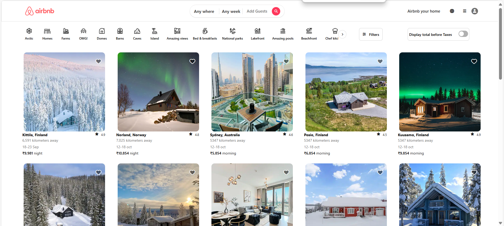

# Airbnb UI Clone

A simple clone of Airbnb's user interface built with HTML and CSS, featuring smooth transitions for a seamless user experience.

## Features

- Clean, modern UI inspired by Airbnb
- Smooth transitions for enhanced interactivity
- Responsive design for desktop and mobile views

## Tech Stack

- **HTML**: Structuring the webpage layout
- **CSS**: Styling the page with focus on layout, fonts, and colors
- **Smooth Transitions**: Creating fluid animations between page elements for a polished look

## Installation

1. Clone the repository:
   ```bash
   git clone https://github.com/your-username/airbnb-ui-clone.git


Web view : 
